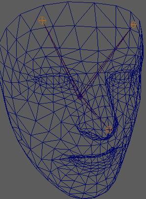

## ARCore - Augmented Faces

This is a demo application of Augmented Faces within Sceneform. The purpose of this demo is to demonstrate the simplicity of added AR to your application by adding textures, 2D Images, or 3D images to your application. This application adds a 2D ImageView (a light bulb) that floats above the user's head. Lastly, it adds a png texture to the user's face for a little blush and freckles. 

In order for ARCore to properly overlay textures and 3D/2D models on a detected face, ARCore provides detected regions and an augmented face mesh. This mesh is a virtual representation of the face, and consists of the vertices, facial regions, and the center of the user's head (typically right behind the user's nose).  The center of the user's face and the mesh can be visualized in the image above. 

The above videos demonstrate the Author's bright ideas! 

# License
Licensed to the Apache Software Foundation (ASF) under one or more contributor license agreements. See the NOTICE file distributed with this work for additional information regarding copyright ownership. The ASF licenses this file to you under the Apache License, Version 2.0 (the "License"); you may not use this file except in compliance with the License. You may obtain a copy of the License at

http://www.apache.org/licenses/LICENSE-2.0

Unless required by applicable law or agreed to in writing, software distributed under the License is distributed on an "AS IS" BASIS, WITHOUT WARRANTIES OR CONDITIONS OF ANY KIND, either express or implied. See the License for the specific language governing permissions and limitations under the License.